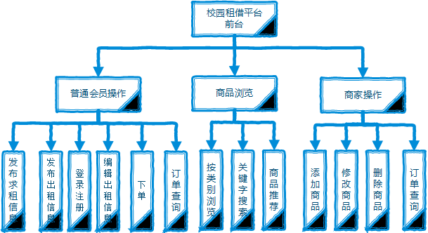
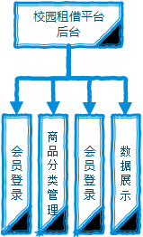
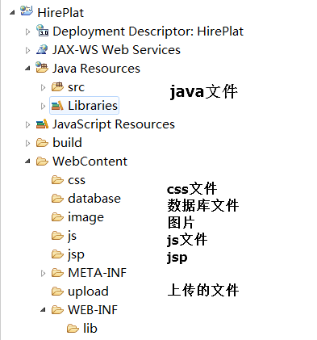

### 校园买卖租借平台系统设计：

### 本平台的功能结构
本平台分为前台和后台两个部分的操作。前台主要有两大功能：

* 租借业务：
* 买卖业务：
#### 前台

1. 用户注册：用户可以通过手机号或邮箱的方式来注册账号，但是要绑定学号和姓名才行。
2. 用户登录：
2. 基本信息管理：用户登录成功后可以查看自己的一些基本信息，也可以修改信息，当然有些信息是不允许修改的，比如学号。
3. 发布出租信息：用户可以出租自己闲置不用的东西，开出一定的价格。
4. 发布求租信息：将自己的需求发布出来
5. 管理：重新编辑自己发布的信息

  
#### 后台

管理员管理
1.发布一些资讯，处理一些不合法的出租买卖信息。
2.可以对普通用户进行冻结账号的操作

### 开发环境
* 服务器端
	* 操作系统：Windows7
	* Web 服务器：Tomcat8.0
	* Java 开发包：JDK1.8
	* 数据库：MySQL 5.5以上
	* 浏览器：google chrome
	* 开发工具：eclipse 

* 客户端：
	* 浏览器：google chrome

### 文件夹组织结构
要保存的文件有：   
网站的：java文件，数据库文件，CSS样式文件，JSP文件，JS文件，网站的图片，JAR包   
用户的：用户上传的图片

### 系统页面设计
* 主页面

* 出租详细信息页面

* 登录页面
* 注册页面
* 用户信息查看页面
* 用户。。。。

#### 系统流程图
游客只能进行浏览，搜索，会员需要登录后才能发布租借信息和查看发布者的联系方式

### 数据库设计
#### 识别实体
会员，管理员，出租信息，求租信息，一次交易，

* 会员：编号，用户名，密码，电子邮件，电话
+ 订单（一次交易）：订单编号，所属会员，交易会员，交易地址，订单状态，付款方式，创建时间，交易金额，
+ 商品信息表：商品编号，商品名称，价格，商品描述，图片地址，商品类别

#### 各个表的ER图

#### 各数据表的结构及建表
